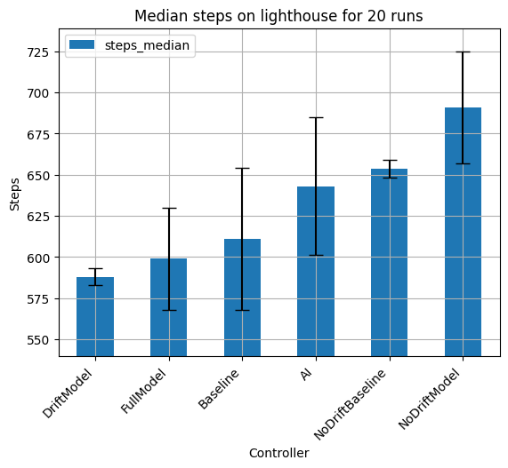

# TransformerKart: A Full SuperTuxKart AI Controller

Deep Reinforcement Learning AI to play the SuperTuxKart race game using a Decision Transformer and gym environment.

Full report available in [pdf](dec-transformer-supertux.pdf).



Full model (steer, drift, and acceleration):

https://user-images.githubusercontent.com/49537743/205192574-885f514d-028f-4eb1-aab8-f7e3fd0aec76.mp4

Steer and drift model:

https://user-images.githubusercontent.com/49537743/205192811-6f483de5-6df6-4b31-9896-7ad2be1db0fa.mp4

- [Results](#results)
- [Training Process](#training-process)
- [Get Data](#get-data)
- [CNN Autoencoder](#cnn-autoencoder)
- [Full Model](#full-model)
- [Steer Model](#steer-model)
- [Drift Model](#drift-model)
- [Evaluate Models](#evaluate-models)
- [Environment](#environment)

## Results

The results obtained by the different models can be found in evaluate.xlsx.
Some sample videos and a chart summarizing the results can be found in the evaluate folder.

## Training Process

The following steps have to be done to train a model:

- Choose the tracks ([Environment](#environment))
- Gather data ([Get Data](#get-data))
- Train CNN autoencoder ([CNN Autoencoder](#cnn-autoencoder))
- Train model

Once the model has been trained and saved, we can evaluate the models by specifying the models to be evaluated in run.py.

## Get Data

It runs the baseline model (with and without noise) on the environment to obtain a dataset of episodes that are used for training our models.

To change the way data is gathered or more information check run.py.

```
python -m run -t
```

## CNN Autoencoder

The CNN autoencoder that is later used by the controller models can be found in agents/cnn.py.

To train the CNN autoencoder on the available data:

```
python -m agents.cnn
```

## Full Model

Learns to steer, drift, and accelerate.

It can be trained from scratch. However, we have first pretrained a CNN autoencoder and used the encoder for the image embedding layer.
To modify this behavior or more information check agents/decision_transformer.py.

The following command trains this model with the autoencoder and data already available:
```
python -m agents.decision_transformer 
```

## Steer Model

Learns to steer and has fixed acceleration and drift disabled.

It can be trained from scratch. However, we have first pretrained a CNN autoencoder and used the encoder for the image embedding layer.
To modify this behavior or more information check agents/decision_transformer.py.

The following command trains this model with the autoencoder and data already available:
```
python -m agents.decision_transformer --no_drift 
```

## Drift Model

Learns to drift and steer, and has fixed acceleration. 

It can be trained from scratch. However, we have used the steer model with the best validation loss as our starting model for training.
To modify this behavior or more information check agents/decision_transformer.py.

The following command trains this model with the steer model and data already available:
```
python -m agents.decision_transformer --fixed_velocity 
```

## Evaluate Models

It runs the set of given models, the baseline, and the game AI for a certain number of episodes to evaluate their performance.

The models being evaluated are preset and need to be unziped before being used (the models are available in the saved folder).
To change the models being evaluated or more information check run.py.

To evaluate the models on the lighthouse track:
```
python -m run --evaluate_lighthouse
```

To evaluate the models on all selected tracks (models given have not been trained in other tracks than lighthouse):

```
python -m run --evaluate
```

## Environment

Gym environment that wraps the [PySuperTuxKart](https://github.com/philkr/pystk) game environment.

To check the environment options or select which tracks to use check environments/pytux.py.
